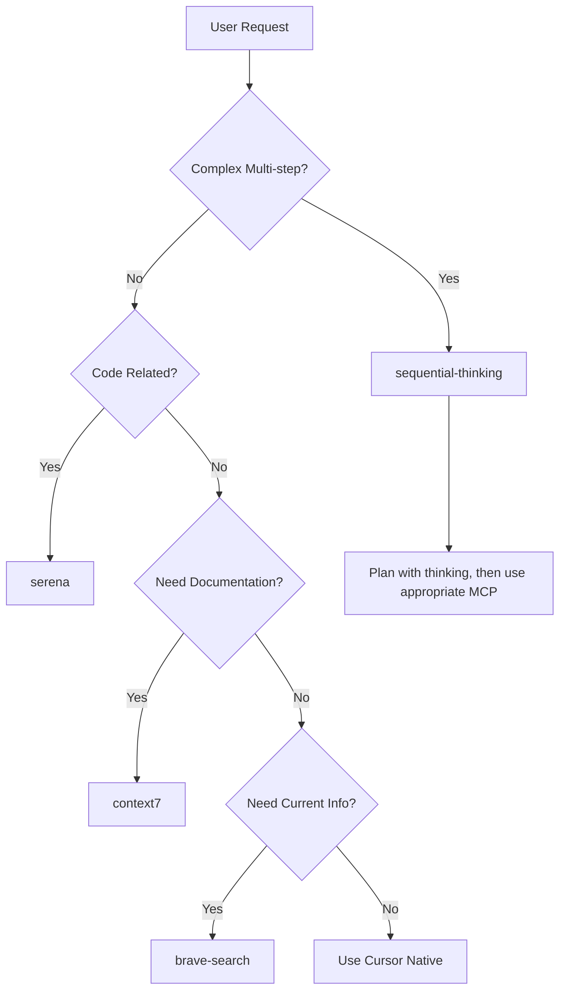

# OPTIMIZED MCP USAGE GUIDE

## 🎯 CURRENT ACTIVE MCP SERVERS

| MCP Server | Tools Count | Primary Function |
|------------|-------------|------------------|
| **serena** | 33 tools | Code Analysis & Editing Expert |
| **context7** | 2 tools | Documentation & Library Lookup |
| **brave-search** | 2 tools | Real-time Web Search |
| **sequential-thinking** | 1 tool | Complex Problem Solving |

**Total: 38 tools** - Optimized for performance and clarity

---

## 🧠 MCP HIERARCHY & DECISION FLOW

### 1. SEQUENTIAL-THINKING → Master Orchestrator
**Use FIRST for any complex task**
```
When to use:
✅ Multi-step problems requiring planning
✅ Complex analysis or decision making  
✅ When unsure which approach to take
✅ Breaking down large tasks into smaller steps

Trigger phrases:
"analyze", "plan", "complex", "multi-step", "approach", "strategy"
```

### 2. SERENA → Code Expert
**Primary tool for ALL code-related activities**
```
Core Functions:
🔍 Code Analysis: onboarding, get_symbols_overview, find_symbol
🔎 Code Navigation: find_referencing_symbols, find_referencing_code_snippets  
✏️ Safe Editing: replace_symbol_body, insert_before_symbol, insert_after_symbol
💾 Context Management: write_memory, read_memory, list_memories

Trigger phrases:
"code", "function", "class", "refactor", "codebase", "project", "implementation"
```

### 3. CONTEXT7 → Documentation Specialist
**First choice for library/framework documentation**
```
Tools:
📋 resolve-library-id → Find correct library identifier
📖 get-library-docs → Retrieve specific documentation

When to use:
✅ Learning new libraries/frameworks
✅ API documentation lookup
✅ Before implementing with unfamiliar technologies
✅ When you need official documentation

Trigger phrases:
"documentation", "API", "library", "framework", "how to use", "reference"
```

### 4. BRAVE-SEARCH → Research Assistant
**For real-time information and general research**
```
Tools:
🔍 brave_web_search → General web search
📍 brave_local_search → Location-based search

When to use:
✅ Latest news, updates, trends
✅ Current best practices
✅ When context7 doesn't have the information
✅ Real-time information needs

Trigger phrases:
"latest", "current", "trending", "news", "recent", "what's new", "search for"
```

---

## 🎮 DECISION MATRIX



---

## 🚀 STANDARD WORKFLOWS

### 🔄 New Project Onboarding
```markdown
1. sequential-thinking → Plan analysis approach
2. serena: onboarding → Auto-analyze project structure  
3. serena: get_symbols_overview → Map key components
4. serena: write_memory → Save architectural insights
5. context7 → Look up unfamiliar libraries/frameworks
```

### ⚡ Code Understanding & Navigation
```markdown
1. serena: find_symbol → Locate specific code element
2. serena: find_referencing_symbols → Understand dependencies
3. serena: get_symbols_overview → Get context of surrounding code
4. context7 → Check library documentation if needed
```

### 🔧 Safe Code Refactoring
```markdown
1. sequential-thinking → Plan refactoring strategy (if complex)
2. serena: find_symbol → Locate target code
3. serena: find_referencing_code_snippets → Check all usages
4. serena: replace_symbol_body → Implement changes safely
5. serena: write_memory → Document changes made
```

### 📚 Learning New Technology
```markdown
1. context7: resolve-library-id → Find correct library
2. context7: get-library-docs → Get official documentation
3. brave-search → Find tutorials and examples if needed
4. serena → Analyze existing code patterns in project
5. sequential-thinking → Plan implementation approach
```

### 🐛 Debugging & Problem Solving
```markdown
1. sequential-thinking → Break down the problem
2. serena: search_for_pattern → Find related code
3. serena: find_referencing_symbols → Trace code flow
4. context7 → Check library documentation for expected behavior
5. brave-search → Look for similar issues/solutions
```

---

## 🎯 SPECIFIC USE CASES

### When Working with Unknown Codebase
```bash
# Step 1: High-level understanding
serena: onboarding

# Step 2: Explore key modules  
serena: get_symbols_overview /src
serena: get_symbols_overview /components

# Step 3: Save findings
serena: write_memory "project_architecture" "Key insights about project structure..."

# Step 4: Research technologies
context7: resolve-library-id "react"
context7: get-library-docs "/facebook/react"
```

### When Implementing New Feature
```bash
# Step 1: Plan approach
sequential-thinking: "How should I implement user authentication with JWT tokens?"

# Step 2: Research best practices
context7: get-library-docs "/auth0/node-jsonwebtoken"  
brave-search: "JWT authentication best practices 2024"

# Step 3: Find integration points
serena: find_symbol "auth"
serena: find_symbol "middleware"

# Step 4: Implement safely
serena: insert_after_symbol "AuthController" "new authentication methods"
```

### When Debugging Issues
```bash
# Step 1: Understand the problem
sequential-thinking: "Analyze why user login is failing intermittently"

# Step 2: Find related code
serena: search_for_pattern "login|authentication|auth"
serena: find_referencing_symbols "AuthController.login"

# Step 3: Check for known issues
brave-search: "intermittent login failures Node.js Express"
context7: get-library-docs "/expressjs/express" "session management"
```

---

## ⚡ EFFICIENCY RULES

### ✅ DO THIS
- Start complex tasks with **sequential-thinking**
- Use **serena** for ANY code modification
- Check **context7** before **brave-search** for documentation
- Use **serena memory** to maintain context across conversations
- Always check references before modifying existing code

### ❌ DON'T DO THIS
- Modify code without using serena's reference checking
- Use brave-search for well-established library documentation
- Skip sequential-thinking for multi-step problems
- Forget to save important findings in serena memory
- Use multiple MCPs for the same information need

### 🎨 OPTIMIZATION TIPS
- **Cache documentation**: Save frequent lookups in serena memory
- **Batch operations**: Plan multiple related tasks with sequential-thinking
- **Context preservation**: Use serena memory between conversations
- **Smart fallbacks**: context7 → brave-search → serena analysis

---

## 🔍 TRIGGER PHRASES QUICK REFERENCE

| Phrase Category | Use MCP | Example Phrases |
|----------------|---------|----------------|
| **Planning** | sequential-thinking | "plan", "analyze", "approach", "strategy", "complex" |
| **Code Work** | serena | "code", "function", "refactor", "codebase", "implement" |
| **Documentation** | context7 | "documentation", "API", "how to use", "library reference" |
| **Research** | brave-search | "latest", "current", "trending", "search", "find info" |

---

## 🛠️ COPY-PASTE CURSOR RULES

```markdown
# MCP USAGE RULES - STREAMLINED SETUP

## PRIORITY ORDER
1. sequential-thinking → For complex/multi-step tasks
2. serena → For ALL code-related work  
3. context7 → For documentation lookup
4. brave-search → For current information/research

## MANDATORY WORKFLOWS

### Code Modification:
```
NEVER modify existing code without:
1. serena: find_symbol → locate target
2. serena: find_referencing_code_snippets → check usage
3. serena: replace_symbol_body → safe modification
```

### New Project:
```
1. serena: onboarding → understand structure
2. serena: write_memory → save insights  
3. context7 → research unknown technologies
```

### Documentation Lookup:
```
1. context7 → official docs first
2. brave-search → if context7 insufficient
3. serena: write_memory → cache findings
```

## TRIGGER DECISION
- Complex task → sequential-thinking first
- Code work → serena always
- Documentation → context7 first  
- Current info → brave-search

Remember: Think → Research → Code → Document
```

---

## 📊 PERFORMANCE METRICS

With this streamlined 4-MCP setup:
- ✅ **38 tools total** - Manageable for all model types
- ✅ **No overlap** - Each MCP has distinct role
- ✅ **Clear hierarchy** - Eliminates decision confusion  
- ✅ **Optimized workflows** - Maximum efficiency
- ✅ **Universal compatibility** - Works with any Cursor model

**Perfect balance of power and performance!** 🎯 